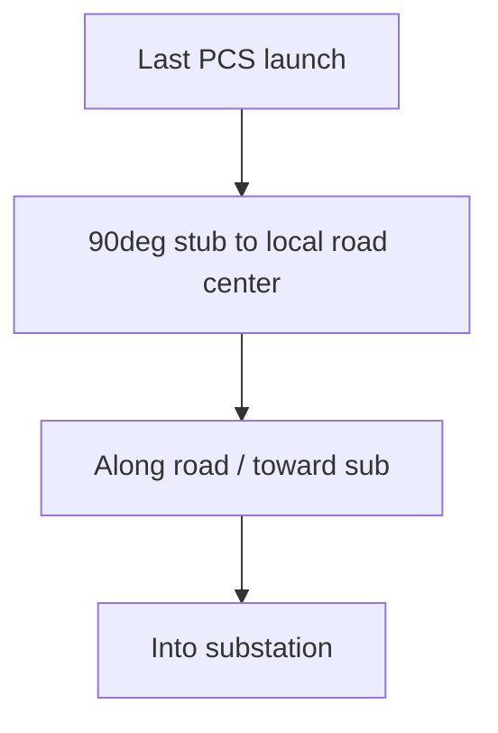

# Feeder road-routing change chronology (for reproduction)

Documentation / rebuild guide for the scan-mode home-run → road mid-strip workstream: what we tried, what we kept, and how to reproduce the current behavior.

**Scope note:** Early in the same effort, MV **row trunks** were moved under PCS centerlines (`cableRouting.ts` / gates). The timeline below focuses on the later **scan-mode home-run → road mid-strip** work. Both live in the same repo lineage.

---

## Product intent (evolved)

Target applies to **scan / KMZ-traced yards** only (`tracedPcsUnits > 0`):

1. After the last PCS: **90° to road center → 90° toward sub → straight to sub**.
2. Ride the **cyan road mid-strip** (software road region), not the shoulder.
3. Smooth stair-step road chatter into long centerline runs.
4. Later: if feeders meet on the road, **path-match** with ~**0.5 ft** lateral offset (anti-braid X-cross stays).
5. Temporarily **hide misplaced yard aux spine** (`design.trench`) visually and as a keepout.

---

## Chronology of attempts

### A. Soft road preference (kept, evolved)

- Added `snapToRoadCenter`, `mergeStairJogs` / `smoothRoadPolyline` / `recenterLongRuns` in [`client/src/lib/nextera/feeders.ts`](../client/src/lib/nextera/feeders.ts).
- Added `preferRoadHomeRun`: stub → ride road network → splice exterior climb/lane.
- Gated on traced yards; fallback to classic comb when soft road fails.

### B. Hard “roads or under PCS only” fail-closed (**discarded**)

- Tried requiring entire in-yard home to stay on `road ∪ PCS pads`.
- **Result:** wiped essentially all feeders. Removed; classic comb restored as fallback.

### C. `simpleScanHomeRun` grammar (kept)

- Explicit L / multi-elbow geometry matching the 90° rule.
- Soft prefer over ideal when candidate clears equipment + cross-bands.

### D. Debug / visualization (kept in tree)

- **Highlight software roads** UI toggle (`showSoftwareRoads` in store + [`DesignControlPanel.tsx`](../client/src/components/DesignControlPanel.tsx)); cyan fill via `SoftwareRoadRegionHighlight` in [`DesignScene.tsx`](../client/src/components/DesignScene.tsx).
- `agentDbg` → ingest + `POST /api/agent-debug-log` in [`server/routes.ts`](../server/routes.ts) → workspace `debug-eecf33.log` (capped ~120 logs/rebuild).

### E. Snap + selection debug fixes (kept)

- **Problem A:** snap preferred shoulder at junctions → always take balanced center when `|midOffset| > 0.25`.
- **Problem D:** discarding simple for `crossesPrior > 0` forced ideal → keep simple whenever non-null.

### F. Long `alignedCenter` jumps (**partially fixed**)

- Walking up to ~800 ft along road for substation-aligned attach caused stubs through equipment.
- **Fix:** attach at **local** `nearCenter`; align walk capped at **48 ft** and only as post-attach mid segment.

### G. Aux trench / prior feeders as blockers (analyzed + mitigated)

- Aux `design.trench` is a **cross band** (perp OK; ride/turn/diagonal illegal) — not a hard wall.
- Prior feeders: `preferRoad` used to require `crossesPrior === 0`; simple did not.
- Collinear separation (>50 ft / 1.5 ft) fought shared road centerlines.

### H. Keepout-redirect plan (follow-on layer)

Built on top of commit `c3340f0` (“trying to make feeders run through the road”):

| Item | Location | Behavior |
|------|----------|----------|
| Hide aux spine | [`feederKeepouts.ts`](../client/src/lib/nextera/feederKeepouts.ts) `SHOW_YARD_AUX_TRENCH = false` | Skip `design.trench` in `cross`; gate scene render/clip/fly cam |
| Trench-aware stub | `simpleScanHomeRun` + `routeStub` | Prefer `routeSegmentTrenchAware(start, nearCenter)` then L elbows |
| Path match ~0.5 ft | `offsetRoadAttach`, `softRoadRank` | Lateral nudge on pavement; skip collinear re-lay for `softRoadGis` |
| Accept preferRoad with priors | home select | `roadOk = !!roadHome` (no `crossesPrior===0`) |
| Last road attempt | `lastRoadHome` | Stub + trench-aware to fence exit before ideal |
| Anti-braid | fail-closed later | **Not** removed — X-cross still illegal |

---

## What is where in git

| Layer | Contents |
|-------|----------|
| Commit `c3340f0` | Core road helpers, `simpleScan` / `preferRoad`, software-roads UI, debug ingest endpoint, large `feeders.ts` road work |
| Follow-on (keepout redirect) | Aux hide flag + DesignScene gating; path-match offset; trench-aware stubs; `lastRoad`; softRoadGis skip; home-select changes; `post-fix3` logs |

Do **not** commit `debug-eecf33.log` when packaging a clean PR.

---

## How to reproduce current behavior

1. Ensure the keepout-redirect layer (section H) is present on top of `c3340f0` (or re-apply H if starting from that commit only).
2. Run app (`npm run dev` / `cmd /c npm run dev` if PowerShell blocks scripts) → http://localhost:5000.
3. Load a **scanned / KMZ-traced** yard with a substation (auto-only yards skip soft road).
4. Enable **Highlight software roads** to see the cyan mid-strip region.
5. Confirm yard **aux blue spine is absent** while `SHOW_YARD_AUX_TRENCH === false`.
6. Regenerate feeders; expect more homes to **turn onto the cyan strip** (chosen `simple` / `roadPrefer` / `lastRoad` in logs), with near-parallel ~0.5 ft offsets when sharing a strip.
7. Optional: inspect `debug-eecf33.log` for `runId:"post-fix3"`, `message:"home path chosen"`, field `chosen`.

---

## Rebuild checklist (if re-implementing from clean `main`)

1. Road geometry helpers + smooth/recenter in `feeders.ts`.
2. `simpleScanHomeRun` + `preferRoadHomeRun` + traced-only home select cascade: simple → preferRoad → lastRoad → ideal → ideal grid discipline.
3. Always-center snap; local attach; align ≤48 ft.
4. `SHOW_YARD_AUX_TRENCH` hide (routing + scene).
5. `offsetRoadAttach` + softRoadGis collinear skip; accept preferRoad despite prior co-runs.
6. Software-roads highlight + (optional) debug ingest.
7. Leave fail-closed X-braid intact.

---

## Still open / known gaps

- Soft road still fails when **equipment** blocks all stub/to-sub elbows (then falls to ideal comb).
- Debug `agentDbg` should be removed once verified.
- Re-enable `SHOW_YARD_AUX_TRENCH` when aux spine placement is corrected.
- Path matching is an intentional temporary relaxation of “own trench” spacing on roads only.
