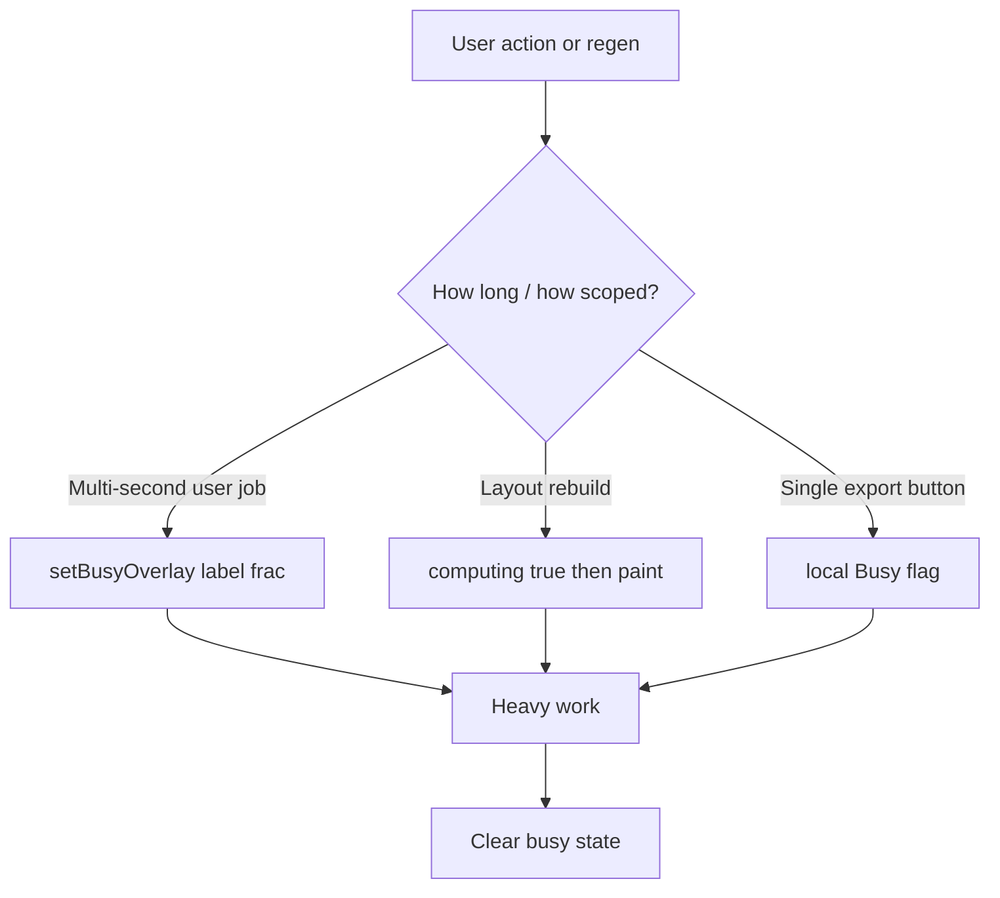

# Loading screens for heavy work

Catalog every heavy BessForge path that can freeze the UI, then wire each gap to the existing BusyOverlay, computing banner, or button-busy patterns—no new loading UI components.

**Status:** implemented (helpers, sync `computing`, P0 BusyOverlay paths, P2 export `*Busy`, spot-check loaders).

---

## Existing patterns to reuse (do not invent new ones)

| Pattern | Where | Use for |
|---|---|---|
| **`BusyOverlay`** + `setBusyOverlay({ label, frac? })` | [`App.tsx`](../client/src/App.tsx) + store | Full-screen, multi-second, user-initiated jobs |
| **`computing` banner** (“Recomputing layout…”) | [`DesignScene.tsx`](../client/src/components/DesignScene.tsx) | Layout regeneration (all paths, including sync) |
| **Button `*Busy` + label swap** | [`DesignControlPanel.tsx`](../client/src/components/DesignControlPanel.tsx) | Per-export clicks (same as `pdfBusy` / `pkg10Busy`) |
| **Inline optimizer bars** | Panel + [`ScenarioComparePanel.tsx`](../client/src/components/ScenarioComparePanel.tsx) | Already covered — leave as-is |
| **Scene HUDs** | Satellite / offline / stills | Already covered — leave as-is |

Helper module: [`client/src/lib/busy.ts`](../client/src/lib/busy.ts)

```ts
async function withBusyOverlay(label: string, work: () => Promise<void>, frac?: () => number)
async function paintThen<T>(fn: () => T): Promise<T> // set state, await 1 frame, then run sync heavy work
```

Sync work must **paint first** (`await new Promise(r => setTimeout(r, 30))` or `requestAnimationFrame` × 2), matching the 10% package / PDF pattern—otherwise the overlay never appears before the main thread blocks.

---

## Hang / heavy-work inventory

### Already covered (keep)

- Boot spinner (`index.html`), React Suspense fallback
- Show-all areas, session restore, reference auto-fill apply → `BusyOverlay`
- View mode switch (3D/CAD/2D) → `BusyOverlay`
- Async single-area worker regen → `computing` banner
- Layout / feeder / grading optimizers + scenario compare → inline progress + Cancel
- PDF plot set, 10% package, permit/LGIA/POI, NOAA IDF → `*Busy`
- Satellite / terrain loading text
- Offline tour + marketing stills progress HUDs
- KMZ upload `isLoading` (“Parsing…”)

### Gaps to cover (priority order)

**P0 — full `BusyOverlay` (user clicked something long)**

1. **Open project** — [`handleOpenProject`](../client/src/components/DesignControlPanel.tsx) → `importProject` (sync multi-area regen). Label: `Opening project…`
2. **Export DXF** — `handleExport`. Label: `Exporting DXF…`
3. **Export DXF package** — `handleExportPackage` (+ zip). Label: `Building DXF package…` (optional `frac` if package stages are easy)
4. **Boundary apply / KMZ drawing parse** — `captureDrawing` / `parseKmlDrawing` during `chooseBoundary` / apply. Label: `Loading site drawing…` (or fold into existing KMZ `isLoading` phase labels)
5. **Arrangement explorer open** — `generateArrangements` in `useMemo` when `showArrangements` flips on. Trigger once via explicit load + `BusyOverlay` (`Generating arrangements…`), cache result
6. **Compliance report first build** — [`CompliancePanel.tsx`](../client/src/components/CompliancePanel.tsx) `buildSiteComplianceReport` on open. Label: `Building compliance report…`
7. **CAD / 2D display-list first build after design change** — [`CadLinework.tsx`](../client/src/components/CadLinework.tsx) / [`PlanFallback2D.tsx`](../client/src/components/PlanFallback2D.tsx) `composeSiteDxf`. Use `BusyOverlay` only when compose is deferred behind a paint (or when view is CAD/2D and design just changed); label: `Building CAD view…`. Avoid flashing on every micro-edit by coalescing: set overlay, rAF, compose, clear

**P1 — reuse `computing` banner for every layout rebuild**

8. **`regenerate({ sync: true })`** — today never sets `computing: true` (only clears it). In [`useDesignStore.ts`](../client/src/lib/stores/useDesignStore.ts) set `computing: true` before sync `generateSiteDesign`, clear after. Callers that need a visible paint (undo, Apply layout, area switch) use `paintThen` or async wrapper
9. **`regenerateAreas` (multi-area)** — set `computing: true` for the whole pass; for user-facing bulk paths prefer `BusyOverlay` with `frac` (area i / N) like show-all already does

**P2 — button `*Busy` (same style as PDF / 10%)**

10. Remaining exports without busy: SLD DXF, BOM sheet DXF, grading DXF, sections DXF, drainage DXF/details DXF, LandXML, BOM CSV, cable schedule CSV/DXF, full BOM, compliance PDF/CSV, energy report, relay DXF — add `*Busy` + disabled + “Exporting…” label (mirror existing PDF buttons)
11. **`auditRoutingGatesForExport` + `computeExportContours`** — fold under the export’s busy/overlay (no separate screen)

**Out of scope for this pass**

- Moving sync work into the worker (only UI coverage)
- New spinner designs / themes
- Toast-based “loading” (toasts were just cleaned up)

---

## Implementation approach



1. Add `withBusyOverlay` / `paintThen` helpers; use them from panel handlers.
2. Fix store: sync `regenerate` and `regenerateAreas` set/clear `computing`.
3. Wrap P0 handlers (open project, DXF, package, boundary drawing parse, arrangements, compliance, CAD compose) with `BusyOverlay`.
4. Add missing export `*Busy` flags for P2 buttons.
5. Spot-check: open a multi-area `.bessforge.json`, Export DXF, Export package, switch to CAD after a big design, Apply optimizer candidate — each shows an existing-style loader before work finishes.

## Implementation todos

| Id | Work |
|---|---|
| `busy-helpers` | Add `withBusyOverlay` / `paintThen` helpers; document reuse of BusyOverlay + computing + `*Busy` |
| `computing-sync-regen` | Set `computing` on sync regenerate and `regenerateAreas`; paint before blocking work where needed |
| `busy-p0-actions` | BusyOverlay for open project, DXF/package export, KMZ drawing parse, arrangements, compliance build, CAD compose |
| `export-button-busy` | Add `*Busy` disabled labels to remaining export buttons (same pattern as `pdfBusy`) |
| `spot-check-loaders` | Verify open project, DXF export, CAD switch, and optimizer Apply each show a loader |

## Key files

- [`client/src/App.tsx`](../client/src/App.tsx) — `BusyOverlay` (reuse only)
- [`client/src/lib/stores/useDesignStore.ts`](../client/src/lib/stores/useDesignStore.ts) — `computing` on sync regen / areas
- [`client/src/components/DesignControlPanel.tsx`](../client/src/components/DesignControlPanel.tsx) — exports, open project, arrangements
- [`client/src/components/CompliancePanel.tsx`](../client/src/components/CompliancePanel.tsx) — report build
- [`client/src/components/CadLinework.tsx`](../client/src/components/CadLinework.tsx) / [`PlanFallback2D.tsx`](../client/src/components/PlanFallback2D.tsx) — CAD compose overlay
- [`client/src/lib/busy.ts`](../client/src/lib/busy.ts) — shared paint / overlay helpers
