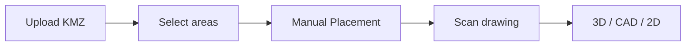

# Manual material placement

After area selection, the user places PCS, battery containers, and aux items on a bare yard, then scans. Generating feeders and cables, and swapping those blocks for full CAD/3D models, stay later product phases.

Implementation is sliced so each step is visible on its own. Do not build snap, catalog commit, or per-item buttons ahead of the slice that owns them.

Saved projects that do not carry `yardAuthoring: 'manual'` keep today’s auto-layout. Reset & Arrangements stays the way to generate a full yard on purpose.

## Product phases

1. **Manual placement** — this work. Individual PCS, battery container, and aux blocks on an empty BESS yard.
2. **Connections** — feeders, cables, and later fiber/aux, routed onto those placements.
3. **CAD and models** — plan symbols and full 3D models in place of the blocks.

## Decisions

- The palette is individual units: PCS, one battery container, and the existing aux items. Composed islands stay on Edit Layout.
- After “show all areas,” each BESS footprint shows the property line and fence only. The imported drawing stays loaded for scan and is hidden during this phase. No auto equipment or roads.
- The placement chrome lives in the sidebar, not on the scene. The section is **Manual Placement**, same heading style as the other tabs.
- **Auto-fill from drawing** / **Scan drawing** is duplicated at the bottom of that tab so it reads as the next step. The original control stays on Site Boundary.

## Slice 1 — Placement indicator (done)

After a KMZ is uploaded and areas are chosen, the sidebar opens **Manual Placement** in [`DesignControlPanel.tsx`](../client/src/components/DesignControlPanel.tsx) (`PANEL_SECTIONS`). There is no scene toolbar for this step.

New imports set `yardAuthoring: 'manual'` on [`LayoutConstraints`](../client/src/lib/nextera/layoutEngine.ts) for each BESS area, from `applyBoundary` and `chooseAllBoundariesWithProgress` in [`useDesignStore.ts`](../client/src/lib/stores/useDesignStore.ts). [`generateSiteDesign`](../client/src/lib/nextera/layoutEngine.ts) draws the fence, and the scene draws the property line. The imported KMZ linework stays loaded for scan but is hidden while `yardAuthoring` is `'manual'`. The layout does not run the block packer, interior roads, augmentation, surfacing, DC cables, or MV feeders. Substation areas keep their current yard.

One placeholder block can be dragged on the site. That drag is local to [`DesignScene.tsx`](../client/src/components/DesignScene.tsx) and does not write `placedEquipment`.

Applying a scan in this slice still leaves the bare yard empty. Filling the yard from the scan is slice 2.

## Slice 2 — Scan, then today’s UI

**Scan drawing** on Manual Placement uses the existing [`ReferenceAutoFill`](../client/src/components/DesignControlPanel.tsx) path (`analyzeReferenceTrace` / `applyReferenceTrace`). Before apply, the user is still on the bare yard.

After apply, leave the placement chrome and render the site the way a scan does today: traced equipment and roads, the current panel sections, and the existing 3D / CAD / 2D views. No new post-scan layout. `commitTraceAdds` keeps appending. It must not rewrite poses of anything already stored with `source: 'manual'` once later slices commit real blocks.

## Slice 3 — Buttons only

Add one button per manual option in the **Manual Placement** section. Labels and nothing else:

- PCS
- Battery container
- Aux transformer, aux switchgear, comms cabinet, aux switch panel, fiber patch panel, fire control panel

Buttons are visible and selectable as UI. They do not place catalog gear yet. The placeholder from slice 1 can stay until slice 5 replaces it.

## Slice 4 — Implement each button

One task per button. Selecting it arms that catalog item: footprint from [`catalog.ts`](../client/src/lib/nextera/catalog.ts), plan outline from [`equipGlyphs.ts`](../client/src/lib/nextera/equipGlyphs.ts) (PE/GE PCS, LG container, aux transformer, distribution, fiber, fire panel). Kinds with no glyph use the catalog rectangle. PCS and containers use the `addPlacedGear` spec shape (`source: 'manual'`). Aux items use the existing `ManualEquipmentSpec` types. Arming shows the right block. It does not snap or persist a drop until slice 5.

## Slice 5 — Drag and snap

Replace the placeholder drag with the real placement session already used for islands in [`DesignScene.tsx`](../client/src/components/DesignScene.tsx): ghost follows the pointer in site feet, snap, click to drop, quarter-turn rotate, drag again to move, delete. Fence misses warn and keep the drop, matching the placed-equipment compose loop in `buildLayout`. Commits go through `addPlacedGear` or the aux manual-equipment path so they survive `regenerate` and area switching. A later scan apply must not move those `x` / `y` / `rotationDeg` values.

Manual drops do not change achieved MW or `tracedPcsUnits`. Feeder routing stays as it is until the connections phase.

## Checks

Cases live in [`scripts/nextera.test.ts`](../scripts/nextera.test.ts). Slice 1: an empty manual yard has no equipment, roads, cables, or surfacing, and an unflagged layout still places blocks. Slice 5: a dropped PCS stays on its catalog footprint, and a trace apply does not move that point.
