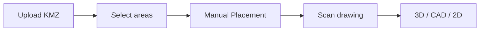

# Manual material placement

After area selection, the user places PCS, battery containers, and aux items on a bare yard, then scans. Generating feeders and cables, and swapping those blocks for full CAD/3D models, stay later product phases.

Implementation is sliced so each step is visible on its own. Do not build grid snap, group alignment, or the remaining palette items ahead of the slice that owns them.

Saved projects that do not carry `yardAuthoring: 'manual'` keep today’s auto-layout. Reset & Arrangements stays the way to generate a full yard on purpose.

## Product phases

1. **Manual placement** — this work. Individual PCS, battery container, and aux blocks on an empty BESS yard.
2. **Connections** — feeders, cables, and later fiber/aux, routed onto those placements.
3. **CAD and models** — plan symbols and full 3D models in place of the blocks.

## Decisions

- The palette is individual units: PCS, one battery container, road, gate, and the existing aux items. Composed islands stay on Edit Layout.
- After “show all areas,” each BESS footprint shows the property line and fence only. The imported drawing stays loaded for scan and is hidden during this phase. No auto equipment or roads.
- The placement chrome lives in the sidebar, not on the scene. The section is **Manual Placement**, same heading style as the other tabs.
- **Auto-fill from drawing** / **Scan drawing** is duplicated at the bottom of that tab so it reads as the next step. The original control stays on Site Boundary.
- Palette order: Road, Gate, Aux transformer, PCS, battery container, aux switchgear, comms cabinet, aux switch panel, fiber patch panel, fire control panel. Icons are baked once into [`placementButtonIcons.ts`](../client/src/lib/nextera/placementButtonIcons.ts). Gate, road, and aux switch panel use placeholders.
- PCS drag-and-drop is implemented. The other buttons select only. Editing a placed item, grid snap, and group alignment are later slices.

## Slice 1 — Placement indicator (done)

After a KMZ is uploaded and areas are chosen, the sidebar opens **Manual Placement** in [`DesignControlPanel.tsx`](../client/src/components/DesignControlPanel.tsx) (`PANEL_SECTIONS`). There is no scene toolbar for this step.

New imports set `yardAuthoring: 'manual'` on [`LayoutConstraints`](../client/src/lib/nextera/layoutEngine.ts) for each BESS area, from `applyBoundary` and `chooseAllBoundariesWithProgress` in [`useDesignStore.ts`](../client/src/lib/stores/useDesignStore.ts). [`generateSiteDesign`](../client/src/lib/nextera/layoutEngine.ts) draws the fence, and the scene draws the property line. The imported KMZ linework stays loaded for scan but is hidden while `yardAuthoring` is `'manual'`. The layout does not run the block packer, interior roads, augmentation, surfacing, DC cables, or MV feeders. Substation areas keep their current yard. A hand-placed PCS is the exception and is composed in slice 4.

## Slice 2 — Scan, then today’s UI (done)

**Scan drawing** on Manual Placement uses the existing [`ReferenceAutoFill`](../client/src/components/DesignControlPanel.tsx) path (`analyzeReferenceTrace` / `applyReferenceTrace`). Before apply, the user is still on the bare yard.

After apply, leave the placement chrome and render the site the way a scan does today: traced equipment and roads, the current panel sections, and the existing 3D / CAD / 2D views. No new post-scan layout. Apply clears `yardAuthoring` so regenerate builds a normal traced yard instead of the fence-only bare site. `commitTraceAdds` keeps appending. It must not rewrite poses of anything already stored with `source: 'manual'`.

## Slice 3 — Buttons (done)

One button per manual option in the **Manual Placement** section, in this order:

- Road
- Gate
- Aux transformer
- PCS
- Battery container
- Aux switchgear, comms cabinet, aux switch panel, fiber patch panel, fire control panel

Buttons are visible and selectable. Icons are the baked 32×32 paths, not rescaled on each render. PCS is the one that places gear (slice 4). The others do not place catalog gear yet.

## Slice 4 — Implement each button

**PCS (done).** Selecting PCS arms a drag on the manual yard. Pointer down anywhere on the yard starts a ghost and pointer up commits through `addPlacedGear('inverter', …)` with catalog dimensions for the active GE or PE configuration and `source: 'manual'`. [`manualAuthoringDesign`](../client/src/lib/nextera/layoutEngine.ts) composes those inverter specs at the stored pose and still skips the packer, roads, cables, surfacing, and MW. The ghost and the committed unit use the same inverter rendering as a scanned PCS (`RealisticEquipment` / the simple box). Escape or clicking PCS again disarms.

The full-yard catcher in [`PcsDrop`](../client/src/components/DesignScene.tsx) sits over the equipment, so a left click on an existing PCS drops another copy. Slice 5 removes that.

The other buttons stay selectable outlines until their own task. Those tasks come after the edit gestures in slice 5, so every later item uses the same left-drag and right-click behavior:

- **Battery container** — same drag later; `addPlacedGear('bess')`; LG JF2 model.
- **Road** — centerline draw, not a block.
- **Gate** — placement comes later. Placeholder icon.
- **Aux transformer** — `ManualEquipmentSpec`; Hitachi aux model.
- **Aux switchgear** — manual spec; aux distribution model.
- **Comms cabinet** — manual spec; catalog box and legend symbol.
- **Aux switch panel** — manual spec; catalog rectangle.
- **Fiber patch panel** — manual spec; fiber model.
- **Fire control panel** — manual spec; fire-control model.

Manual drops do not change achieved MW or `tracedPcsUnits`. Feeder routing stays as it is until the connections phase. Commits survive `regenerate` and area switching. A later scan apply must not move those `x` / `y` / `rotationDeg` values.

## Slice 5 — Edit a placed item

Next slice. Applies to a placed PCS now, and to later items the same way. Placement in this slice is free: no grid snap yet.

- Left click on a placed item drags that item. Releasing writes its new `x` / `y` through the existing manual pose update (`updatePlacedEquipment` / `moveEquipment` for a `source: 'manual'` id). It does not call `addPlacedGear`.
- A new copy is only created by dragging on empty ground while that palette button is armed. The catcher plane in `PcsDrop` must sit behind the equipment hit target so a click on a unit never starts a new drop.
- Right click on a placed item opens a small menu: **Delete** (remove that `placedEquipment` spec), **Duplicate** (another `addPlacedGear` of the same kind, offset so the copy is not stacked on the original), **Rotate** (one quarter turn via `rotatePlacedEquipment`).

## Slice 6 — Grid or free

A placement-mode control on Manual Placement, next to the palette:

- **Grid** draws a site grid and snaps a drag (new drop or move) so the item aligns to that grid. Spacing reuses the existing placement snap steps (`PLACEMENT_SNAP_STEPS_FT` / `snapPlacementCenter` in [`layoutEngine.ts`](../client/src/lib/nextera/layoutEngine.ts)), default `PLACEMENT_SNAP_DEFAULT_FT`.
- **Free** is the slice 5 behavior: the pointer position is the pose, with no snap.

## Slice 7 — Align a group

Later, after several item types can be placed.

- Multi-select placed items.
- Align the selection on X, on Y, or to the rotation of one chosen item in the selection.
- Writes the same stored poses as a drag, so a later scan still does not move `source: 'manual'` items.

## Checks

Cases live in [`scripts/nextera.test.ts`](../scripts/nextera.test.ts).

- Slice 1: an empty manual yard has no equipment, roads, cables, or surfacing, and an unflagged layout still places blocks.
- Slice 4: a dropped PCS stays on its catalog footprint and adds no roads or MW. A trace apply does not move that point.
- Slice 5: dragging a placed PCS changes that id’s pose and does not add a second id; delete removes it; duplicate adds one offset copy; rotate changes `rotationDeg` by 90.
- Slice 6: grid mode snaps a drop onto the grid; free mode keeps the raw point.
