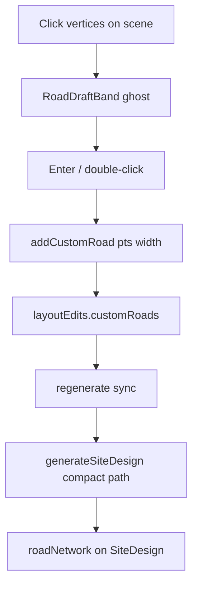

# Manual road placement (Road button)

Reuse the existing Edit Layout polyline draw-road flow (`addCustomRoad` + `evaluateDrawnRoad`) for the Manual Placement Road button, and teach the fence-only manual-authoring path to actually compose those custom roads into a visible road network.

Companion to [`manual-material-placement.md`](manual-material-placement.md) (Slice 3 Road palette button).

**Status:** planned (not implemented).

---

## How roads work today

- **Draw UX** lives in [`DesignScene.tsx`](../client/src/components/DesignScene.tsx) when `editTool === 'road'`: click centerline vertices (`snapRoadPoint` — 1 ft grid + ~6° snap to 45° axes), live `RoadDraftBand` via `evaluateDrawnRoad`, Enter / double-click commits, Esc cancels. Width from `roadDrawWidth` (**24 / 30 / 36** ft).
- **Commit** is [`addCustomRoad`](../client/src/lib/stores/useDesignStore.ts) (~7088): validates length ≥ 5 ft, appends `{ id, pts, width? }` to `layoutEdits.customRoads` (no `traced` flag — that is KMZ-only), sync regenerates, reverts on `Drawn road <id> rejected:` warning.
- **Engine** only unions drafter strips into `roadNetwork` when `roadMode === 'compact'` **and** `customRoads.length` ([`layoutEngine.ts`](../client/src/lib/nextera/layoutEngine.ts) ~8271). Scan Apply already sets `roadMode: 'compact'`.
- **Validation** uses [`evaluateDrawnRoad`](../client/src/lib/nextera/layoutEngine.ts) / `drawnRoadLegalRegion` — on an empty fence-only yard (no equipment), almost any in-fence polyline is legal. Compact uses pad clearance 0; accept ≥98% legal strip / min new area gate.

## Blocker: manual authoring short-circuit

[`generateSiteDesign`](../client/src/lib/nextera/layoutEngine.ts) returns [`manualAuthoringDesign`](../client/src/lib/nextera/layoutEngine.ts) immediately when `yardAuthoring === 'manual'`. That design always has `roads: []`, `roadNetwork: null`. So today `addCustomRoad` would store edits but **never show pavement** and never emit rejection warnings.

Selecting Road must therefore extend the manual-authoring path, not clear `yardAuthoring` (clearing would run the block packer and fill the yard).

## Chosen approach

Reuse the existing polyline + `addCustomRoad` pipeline. Do **not** invent a new road data shape. Teach manual authoring to compose `customRoads` the same way the compact custom-road branch does. Arm drawing from the Manual Placement Road button (sidebar chrome), not by flipping the full Edit Layout toolbar.

### 1. Engine — compose roads on a bare manual yard

In `generateSiteDesign`, when `isManualAuthoringYard`:

- If `constraints.customRoads` is empty → keep today’s fence-only `manualAuthoringDesign`.
- If custom roads exist → build a fence-only design **plus** a `roadNetwork` from those strips (same fillet / legal-region / reject-prefix rules as the compact `customRoads` loop). Equipment list stays empty; no packer, cables, or feeders.

Implementation detail: extract or call the existing compact custom-road network builder with `equipment = []`, `compact = true`, so reject warnings stay byte-stable (`Drawn road <id> rejected:`). Attach resulting `roadNetwork` / `roads` / warnings onto the manual design.

### 2. Store — compact mode on first manual road

In `addCustomRoad`, when `layoutEdits.yardAuthoring === 'manual'`, also set `roadMode: 'compact'` (mirror scan Apply). Needed if any future path leaves manual authoring with those roads still present.

### 3. UI — arm draw from the Road button

Today `placeMaterialSelected` is **local React state only** in [`DesignControlPanel.tsx`](../client/src/components/DesignControlPanel.tsx) (~3083) — DesignScene cannot see it. Lift selection to the store (e.g. `placeMaterialKind: 'road' | 'pcs' | … | null`) so the scene can arm drawing.

In [`DesignControlPanel.tsx`](../client/src/components/DesignControlPanel.tsx), when `placeMaterialKind === 'road'` and `manualYard`:

- Show a short hint: click vertices, Enter / double-click to finish, Esc cancels.
- Show width chips (**24 / 30 / 36**, same as Edit Layout Draw Road) wired through a small store field (e.g. `manualRoadWidth`) so DesignScene and the sidebar stay in sync without prop drilling.

In [`DesignScene.tsx`](../client/src/components/DesignScene.tsx):

- When `placeMaterialKind === 'road'`, run the **same** road-draw interaction currently gated by `editTool === 'road'` **without** requiring full Edit Layout mode / toolbar. Reuse `RoadDraftBand`, `snapRoadPoint`, and `addCustomRoad` — do not invent a second commit path.
- On successful commit, keep Road selected so the user can draw another strip; clear draft points only.
- Esc cancels the in-progress polyline (existing behavior); second Esc or deselecting Road ends the session.
- Defer Remove / span-cut / pave to Edit Layout (already exist) — out of scope for this Road button pass.

Note: PCS / battery / aux face the same `manualAuthoringDesign` short-circuit for `placedEquipment` — out of scope here; fix roads first, then reuse the “compose under manual authoring” pattern for gear in Slice 4–5.

### 4. Docs

Update [`manual-material-placement.md`](manual-material-placement.md) Slice 4 (or a Road-specific note under Slice 3/4): Road arms the existing polyline draw + `addCustomRoad`; manual authoring composes `customRoads` into `roadNetwork`; manual-drawn roads are not `traced: true` (scan roads stay traced).

### 5. Checks

Add a focused case in [`scripts/nextera.test.ts`](../scripts/nextera.test.ts):

- `yardAuthoring: 'manual'` + one `customRoads` strip → design has non-null `roadNetwork` (or equivalent roads surface), still zero equipment.
- Reject path still fires for a path that cannot form a strip (too short / invalid) under manual authoring.

## Implementation todos

| Id | Work |
|---|---|
| `engine-manual-roads` | Compose `customRoads` into `roadNetwork` inside manual-authoring `generateSiteDesign` path |
| `store-compact-on-draw` | `addCustomRoad` sets `roadMode` compact when `yardAuthoring` is manual |
| `ui-arm-road-draw` | Lift `placeMaterialKind` to store; Road arms scene polyline draw + width chips; reuse `addCustomRoad` without full Edit Layout toolbar |
| `docs-and-test` | Update `manual-material-placement.md`; add `nextera.test` case for manual yard + custom road |

## Out of scope

- Arming PCS / battery / aux (separate Slice 4 tasks)
- Entrance / gate / apron flags on hand-drawn roads (traced-only today)
- Road remove UI inside Manual Placement
- Changing scan Apply behavior beyond what already clears `yardAuthoring`
