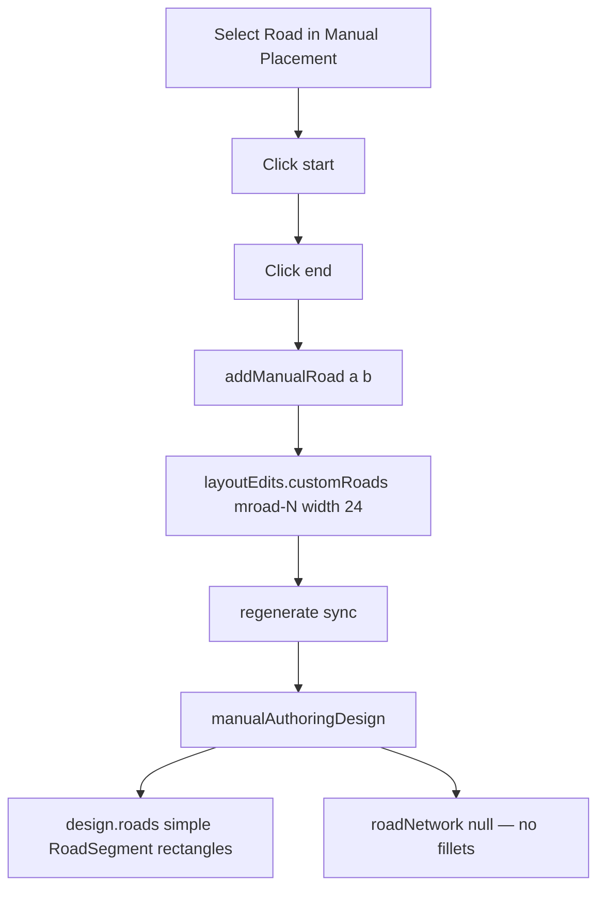

# Manual road placement — filleted road network

Upgrade Manual Placement Road from today’s simple 2-click rectangles to the same **filleted compact `roadNetwork`** Edit Layout already builds from `customRoads`.

Companion to [`manual-material-placement.md`](manual-material-placement.md) (Slice 3/4 Road). Gear/gate placement stays as shipped.

**Status:** implemented (upgrade from 2-click rectangles to filleted `roadNetwork`; path-then-generate UX).

---

## Path-then-generate (how to use it)

You mark a **centerline path**; the code **generates** the full-width filleted pavement. Same idea as bare scan roads — only the path source differs:

| | Path source | Strip builder |
|---|---|---|
| Bare scan | KMZ geometry (`traced: true`, optional verbatim surface) | `buildRoads` → `filletPolylineStrip` |
| Manual Road | Your clicks → `customRoads` | Same `buildRoads` / `filletPolylineStrip` |

**Steps:** Manual Placement → Road → click path vertices → Enter / double-click to generate. Escape cancels the draft (again to disarm Road).

**Preview:** thin dashed centerline + vertex dots are what you are authoring. The translucent filleted band is a **ghost** of the strip that will generate on commit — not freehand pavement painting. Red/grey states still mirror the commit gates (blocked / nothing-to-add).

---

## What shipped

Manual Placement Road uses the Edit Layout polyline commit path (`addCustomRoad` + width chips) and [`manualAuthoringDesign`](../client/src/lib/nextera/layoutEngine.ts) builds a filleted compact `roadNetwork` from `customRoads` (via `buildRoads(..., compact: true)`). Existing two-point `customRoads` still pave. Draw preview is path-first (`ManualRoadDraw` + ghost `RoadDraftBand`).

---

## Baseline (before this upgrade)

```mermaid
flowchart TD
  arm[Select Road in Manual Placement] --> click1[Click start]
  click1 --> click2[Click end]
  click2 --> add[addManualRoad a b]
  add --> edits["layoutEdits.customRoads mroad-N width 24"]
  edits --> regen[regenerate sync]
  regen --> engine[manualAuthoringDesign]
  engine --> segs["design.roads simple RoadSegment rectangles"]
  engine --> nullNet["roadNetwork null — no fillets"]
```

- **Palette** — store field [`manualPlaceItem`](../client/src/lib/stores/useDesignStore.ts) (already lifted; scene + panel share it). Not local `placeMaterialSelected`.
- **Draw (old)** — two ground clicks → [`addManualRoad`](../client/src/lib/stores/useDesignStore.ts) (now a thin wrap of `addCustomRoad`).
- **Compose (now)** — [`manualAuthoringDesign`](../client/src/lib/nextera/layoutEngine.ts) calls compact `buildRoads` so strips fillet into `roadNetwork`. Hand-placed equipment and gate still compose on the same path.
- **Edit Layout** remains available as a separate tool.

## Goal (met)

Manual Placement Road produces the **same visual and data shape** as Edit Layout compact drawn roads: filleted `roadNetwork`, multi-vertex draw, and width chips, while keeping `yardAuthoring: 'manual'`. UX frames it as mark path → generate (same fillet builder as bare scan).

## Approach (executed)

### 1. Engine

`manualAuthoringDesign` calls `buildRoads` with `compact: true` and `allowEmptyEquipment: true` when `customRoads` exist; attaches `roadNetwork` / `roads` / reject warnings.

### 2. Store

`addCustomRoad` sets `roadMode: 'compact'` when `yardAuthoring === 'manual'`. `addManualRoad` wraps `addCustomRoad`.

### 3. UI

`ManualRoadDraw` in [`DesignScene.tsx`](../client/src/components/DesignScene.tsx) when `manualPlaceItem === 'road'`: thin path + ghost `RoadDraftBand` + `addCustomRoad`. Width chips via `manualRoadWidth` in the Manual Placement panel. Hit handles for roads come from `customRoads` (not empty `design.roads`).

### 4. Docs

[`manual-material-placement.md`](manual-material-placement.md) Slice 4 Road bullet updated.

## Out of scope (unchanged)

- Changing PCS / battery / aux / gate placement
- Entrance / gate / apron flags on hand-drawn roads (traced-only today)
- New Road-only remove UI
- Changing scan Apply beyond clearing `yardAuthoring`
- Sparse waypoint auto-route or start/end-only draw
- Running the full NextEra suite without explicit permission
