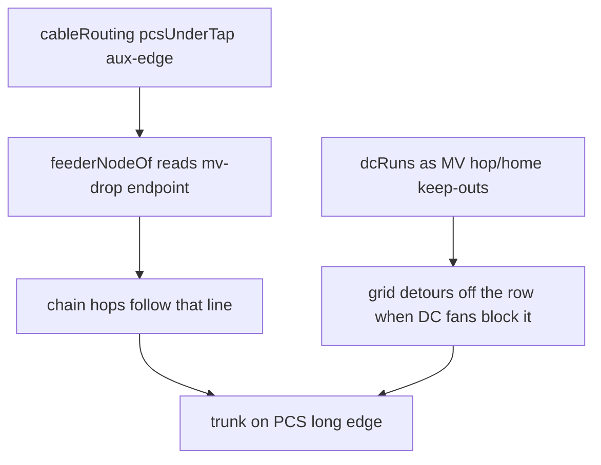

# Restore feeders under PCS; keep Direct DC

Plan to put MV **row trunks** back under the PCS (not along the aux-edge / drive face) while leaving Direct DC (trench wires + diagonals) unchanged.

**Do not** reset [`feeders.ts`](../client/src/lib/nextera/feeders.ts) to `f08af7a`. That snapshot predates the Feeder-Testing merge: scan/pre-scan split, Area 1–4 comb, rotation-aware line keys, and the autofill around-the-yard leave. Checking it out would throw away working post-scan routing.

## Goal

- **Feeders:** hops sit **under the PCS** (centerline collector), as they did when `mv-drop-*` landed at skid center — not a parallel line on the aux long edge
- **Scan yards (Big Iron / KMZ):** keep current comb, no-yard-cut, no-crossing behavior
- **Pre-scan / autofill:** keep the post-merge hop snap and around-the-end home runs
- **Direct DC:** leave Direct/dogleg **path building** and the `direct` default alone

## Why feeders sit on the edge today

Two independent inputs, both from the AW cable series (`f08af7a` → `f24cd03` → `41b4bbc`), not from the Feeder-Testing comb.

1. **Aux-edge `mv-drop` (primary).** [`cableRouting.ts`](../client/src/lib/nextera/cableRouting.ts) `pcsUnderTap` lands the collector at `underLy = ±(width/2 − 0.5 ft)` — the free long edge, away from the cans. Both routers join hops at that point (`feederNodeOf` on `mv-drop-<PCS id>`). Restoring `feeders.ts` from `f08af7a` **does not fix this**: that file already consumed `mv-drop` endpoints, so it would still ride the edge.

2. **Direct DC as MV obstacles (secondary).** `dcRuns` are concatenated into `crossesForbidden` and `cableKeepOutFrom` in **both** [`feeders.ts`](../client/src/lib/nextera/feeders.ts) and [`feedersPrescan.ts`](../client/src/lib/nextera/feedersPrescan.ts). Diagonal Direct fans occupy the under-skid channel, so the hop router shoves the trunk into the aisle. Courtyard `clusterRects` already keep hops out of the PCS–battery zone; DC polylines must not also block the legal under-PCS line.

`ROW_JOG_SNAP` is **not** the edge bug. It was added so a few feet of join stagger does not become an L-jog. Keep it in both routers. After a centerline restore it is a no-op on aligned rows.

## What must not be reverted

Leave these in place (scan and/or pre-scan as they exist today):

- Dispatch: `tracedPcsUnits === 0` → [`feedersPrescan.ts`](../client/src/lib/nextera/feedersPrescan.ts); else [`feeders.ts`](../client/src/lib/nextera/feeders.ts)
- Scan comb: `endAroundComb`, rotation-aware `rowKeyOf` / `lineCoordOf`, Area 1 column climb, Areas 2–4 around-the-end packing, aisle probe, corridor clamp that refuses to push lanes into the yard
- Pre-scan autofill: `ROW_JOG_SNAP`, `autoMultiRow` around-the-end homes, skipped late repairs that re-cut the yard
- Direct DC: `dcPairPaths` / dogleg / `dcRouting` default `'direct'`

## Implementation

### 1. Restore the under-skid **centerline** join (small `cableRouting` delta)

This is MV attach geometry, not Direct DC. Do **not** revert Direct/dogleg fans or the `direct` default.

In [`pcsUnderTap`](../client/src/lib/nextera/cableRouting.ts) (and any auto-row `mv-drop` that uses it):

- Collector end at **skid centerline**: `underLy = 0` (or equivalent `ly = 0` world point `{ mvX, inv.y }` for axis-aligned auto rows)
- Keep the aux-face **tap** as it is (face stub → under-skid)
- Comment: centerline is the MV trunk; courtyard `clusterRects` keep hops out of the cans — do not park the collector on the aux edge to dodge Direct fans

`41b4bbc` also pointed **legacy auto-row** drops at `pcsUnderTap`. Those must move with it, or autofill stays on the edge.

### 2. Stop treating Direct DC as MV keep-outs (both routers)

In [`feeders.ts`](../client/src/lib/nextera/feeders.ts) **and** [`feedersPrescan.ts`](../client/src/lib/nextera/feedersPrescan.ts):

- Stop collecting / using `dcRuns` as MV keep-outs
- `crossesForbidden`: score only `priorHomes` + `priorHops`
- Hop / home-run `cableKeepOutFrom(...)`: prior MV trenches only (no DC)
- Short comment: courtyard `clusterRects` cover the PCS–battery zone; Direct/dogleg fans must not block under-PCS channels

Do **not** reintroduce `clipDcRunsOutsidePads` or other keep-out experiments.

### 3. Do not reset `feeders.ts` to `f08af7a`

No `git checkout f08af7a -- client/src/lib/nextera/feeders.ts`. That removes `oppositeChainExit` / comb / scan dispatch and puts Big Iron back to pre-Area-1 routing.

No need to remove `ROW_JOG_SNAP` once the collector is on centerline.

### 4. Do not touch Direct DC path building

- No edits to Direct/dogleg construction in [`cableRouting.ts`](../client/src/lib/nextera/cableRouting.ts) beyond the `pcsUnderTap` / `mv-drop` centerline join
- Default DC mode stays `direct`

### 5. Tests

- Keep [`scripts/feeder-comb.test.ts`](../scripts/feeder-comb.test.ts) — scan comb invariants (ordering, no foreign-pad trenches, axis-aligned zero crossings). A `f08af7a` restore would fail this file
- Align [`scripts/nextera.test.ts`](../scripts/nextera.test.ts) only if an assertion encoded aux-edge launch or DC-fan collision; do not drop comb / under-PCS checks
- If [`scripts/feeder-dc-keepout.test.ts`](../scripts/feeder-dc-keepout.test.ts) exists: assert empty DC→MV keep-outs and that an under-row hop still works with Direct-style DC present; otherwise a small assertion in `nextera.test.ts` or a focused `tsx` script
- After the centerline join: hops on an autofill island should be 2-point trunks through PCS `y` (or column `x`), not `± width/2`
- `npm run test:feeder-comb` plus feeder-related scripts as applicable

### 6. Verify visually

- **Scanned Big Iron:** Areas 1–4 still comb; no yard cuts; MV hops under PCS, not on the long-edge aisle
- **Autofill / pre-scan:** same under-PCS hops; homes still leave around the yard end (not north through cans)
- **Direct DC:** red/blue diagonals unchanged

## Out of scope

- Mid-island 10 ft aux corridor work
- Reverting Direct DC or trench drawing / yaw
- Throwing away Feeder-Testing scan/pre-scan routing
- Cesium token / unrelated AW commits beyond feeder keep-out + MV attach join

## Todos

- [ ] Restore `pcsUnderTap` / auto-row `mv-drop` collector to PCS centerline in `cableRouting.ts` (Direct/dogleg untouched)
- [ ] Remove `dcRuns` from MV keep-outs / `crossesForbidden` / `cableKeepOutFrom` in **both** `feeders.ts` and `feedersPrescan.ts`
- [ ] Keep scan comb + pre-scan snap / `autoMultiRow`; do not checkout `f08af7a` `feeders.ts`
- [ ] Update tests (feeder-comb stays; add or adjust DC-keep-out / under-PCS hop checks)
- [ ] Smoke-check Big Iron + autofill: hops under PCS, Direct fans still visible
