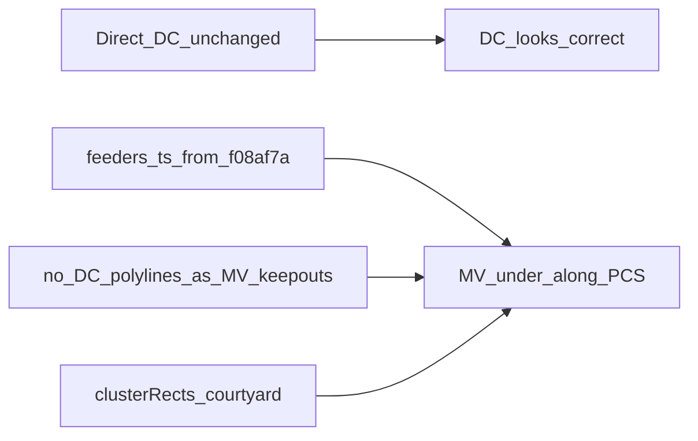

# Restore feeders; keep Direct DC

Plan to restore MV feeder routing to the `f08af7a` (“PCS wires in trench”) baseline while leaving Direct DC (trench wires + diagonals) unchanged.

## Goal

- **Feeders:** behave as they did at `f08af7a` (“PCS wires in trench”)
- **Direct DC:** leave [`client/src/lib/nextera/cableRouting.ts`](../client/src/lib/nextera/cableRouting.ts) alone (trench wires + diagonals stay)

## Why this works

At `f08af7a`, `feeders.ts` still had the older exit/hop logic (no `padBeyond` / `oppositeChainExit`, no row jog-snap, simpler `columnRoadX` / launch punch). After that, `d01160b` and `f24cd03` rewrote home-run exits and hop snapping; `41b4bbc` added Direct DC. Direct diagonals + DC-as-MV-keepouts shove trunks off the PCS row.

Restoring feeder logic alone is not enough if we also restore DC keep-outs: with Direct DC kept, we **must omit DC polylines from MV obstacles** and rely on courtyard `clusterRects` (same intent as AW’s `d755701`).

## Implementation

### 1. Reset feeder router to `f08af7a`

- Checkout baseline: `git checkout f08af7a -- client/src/lib/nextera/feeders.ts`
- That removes the post-`f08af7a` regressions in one shot, including:
  - `padBeyond` / `oppositeChainExit` and all home-run / repair call sites
  - `ROW_JOG_SNAP` / `rowSnapped` hop path
  - `roadSideLaunchRect` + `cableKeepOutFrom(..., roadLaunch)`
  - `PAST = 20`, rewritten `columnRoadX`, hop-shift “away” bias

### 2. One intentional delta on top of that baseline (required for Direct DC)

In restored [`client/src/lib/nextera/feeders.ts`](../client/src/lib/nextera/feeders.ts):

- Stop collecting / using `dcRuns` as MV keep-outs
- `crossesForbidden`: score only `priorHomes` + `priorHops`
- Hop / home-run `cableKeepOutFrom(...)`: pass prior MV trenches only (no DC)
- Short comment that courtyard `clusterRects` cover the PCS–battery zone; Direct/dogleg fans must not block under-PCS channels

Do **not** reintroduce `clipDcRunsOutsidePads` or other keep-out experiments.

### 3. Do not touch Direct DC

- No edits to Direct/dogleg path building in [`cableRouting.ts`](../client/src/lib/nextera/cableRouting.ts)
- Default DC mode stays `direct`

### 4. Tests

- Align [`scripts/nextera.test.ts`](../scripts/nextera.test.ts) feeder expectations with under-PCS / road-face behavior (drop assertions that encoded the post-`f08af7a` exit / DC-fan collision rules if they fail)
- If [`scripts/feeder-dc-keepout.test.ts`](../scripts/feeder-dc-keepout.test.ts) exists on the branch (AW), assert empty DC→MV keep-outs and that under-row launch still works with Direct-style DC present; otherwise add a minimal assertion in `nextera.test.ts`
- Run the feeder-related test scripts / `npm run check` as applicable

### 5. Verify visually

Regenerate a traced yard: Direct DC diagonals unchanged; MV feeders sit under/along the PCS row again (not pad-edge + 8 ft aisle shove).

## Out of scope

- Mid-island 10 ft aux corridor work
- Reverting Direct DC or trench drawing
- Cesium token / unrelated AW commits beyond feeder keep-out behavior

## Todos

- [ ] Restore `client/src/lib/nextera/feeders.ts` from `f08af7a`
- [ ] On restored `feeders.ts`, remove `dcRuns` from MV keep-outs / `crossesForbidden` / `cableKeepOutFrom`
- [ ] Update nextera (and feeder-dc-keepout if present) tests for restored feeders + no DC keep-outs
- [ ] Confirm `cableRouting` Direct DC untouched; smoke-check feeders under PCS with Direct fans present
